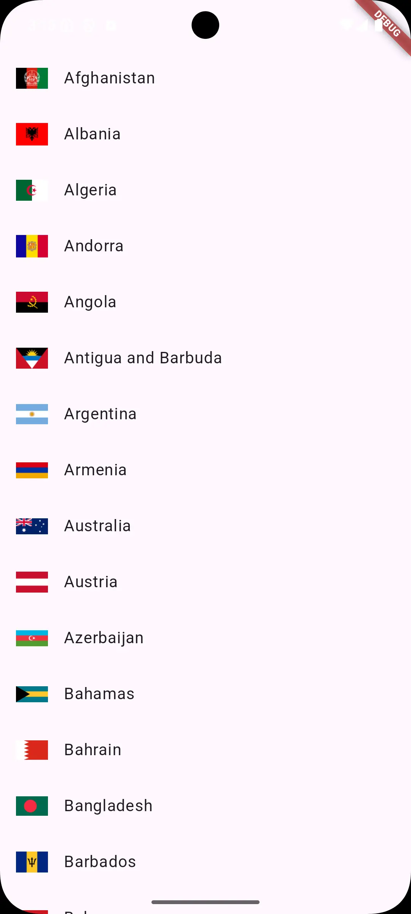

# country_list

A Flutter package providing a list of sovereign countries with customizable features and high-quality flag images.

## Features

- **Customizable**:  
  Fully customize the appearance of each country item. Use the `itemBuilder` parameter to create your own country item design.

- **Sortable**:  
  Sort countries by name or country code. Use the `sortBy` parameter to change the order of countries.

- **High-Quality Flags**:  
  Choose between small and high-quality flag images. Set the `quality` parameter to control flag image resolution.

## Installation

Add `country_list` to your `pubspec.yaml` file:

```yaml
dependencies:
  country_list:
    git:
      url: https://github.com/khsuzan/country_list.git
```

For more detailed documentation on how to use the `country_list` package, please visit the official documentation here:
[**Country List Documentation**](https://fenzybd.github.io/country_list_doc)

## Preview

